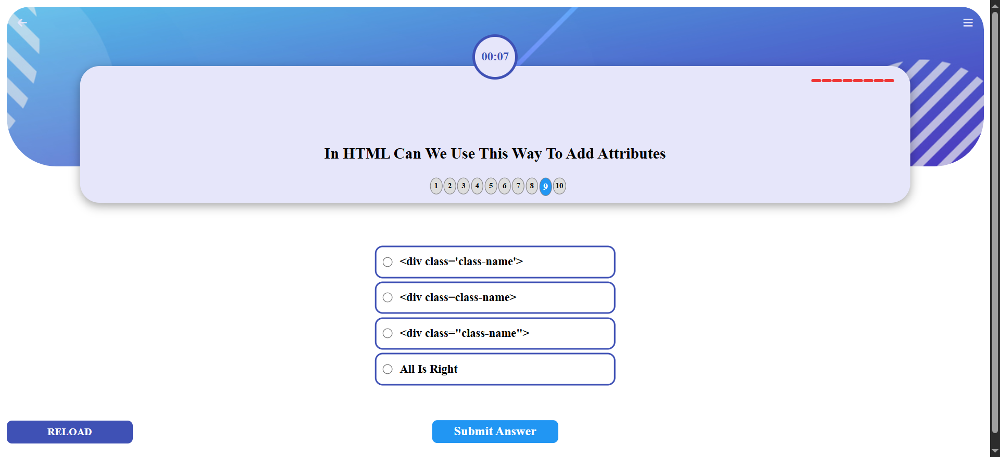
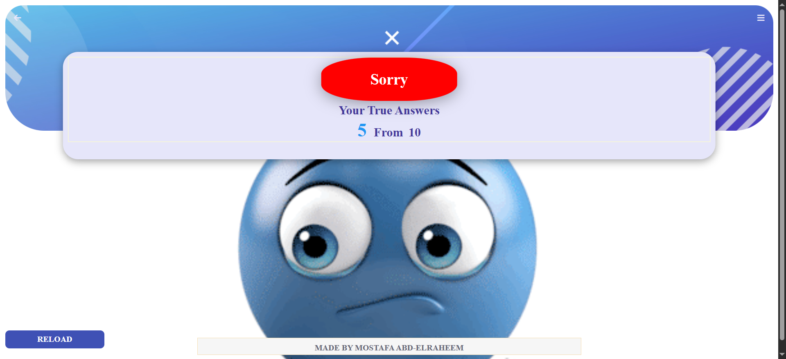

# Quiz Web App (Vanilla JS)

Interactive quiz built with plain HTML, CSS, and JavaScript. Questions are loaded from a local JSON file, a countdown runs for every question, and the app shows correct/incorrect progress plus a final result screen.
This README was organized with assistance from AI to streamline its structure and formatting.

## Project screenshots
    
    
    
    


## Features
- Countdown timer per question (auto-submits when time hits zero)
- Dynamic questions/answers rendered from `html_q.json`
- Progress bullets highlighting the current question
- Running tally of correct and wrong answers
- Result screen with success/sad backgrounds and a reload button

## Project structure
- `index.html` — main page that bootstraps the quiz UI
- `master.js` — quiz logic (XHR data loading, countdown, scoring, result view)
- `html_q.json` — question bank (title, four answers, `right_answer`)
- `css/master.css` — primary styling for layout, bullets, results, and buttons
- `css/*.css` — supporting styles (Font Awesome, reset, etc.)
- `imgs/` — UI background and result images

## Getting started
Because the app fetches `html_q.json`, you need to run it from a local server (opening the HTML file directly will block XHR).

Choose one option in the project root:
- VS Code Live Server: right-click `index.html` -> Open with Live Server
- Python 3: `python -m http.server 8000`
- Node: `npx http-server .`

Then open `http://localhost:8000/` (or the port you used).

## Deployment
```json
{
  "platform": "Vercel",
  "status": "under development",
  "createdBy": "Mostafa Abdellraheem",
  "github": "https://github.com/MostafaAbelraheem2020",
  "linkedin": "https://www.linkedin.com/in/mostafa-mohamed-63b87627a/",
  "whatsapp": "https://wa.me/01010317417"
}
```

## How it works
1) On load, `master.js` fetches `html_q.json` via `XMLHttpRequest`.  
2) Bullets and the first question are rendered; a 10-second timer starts.  
3) Clicking "Submit Answer" (or timer expiry) moves to the next question, updates correct/wrong counters, and advances the bullet.  
4) After the last question, a result view shows your score and themed background plus a reload button.

## Editing questions
Update `html_q.json`; each item uses:
  
```json
{
  "title": "Question text",
  "answer_1": "Option A",
  "answer_2": "Option B",
  "answer_3": "Option C",
  "answer_4": "Option D",
  "right_answer": "Option B"
}
```

## Customization tips
- Change timing: adjust `countDown(10, qCount)` and `resetTimer(10, qCount)` in `master.js`.
- Update styling: edit `css/master.css` (colors, layout, result backgrounds).
- Swap images: replace assets in `imgs/` referenced by the CSS result classes.

